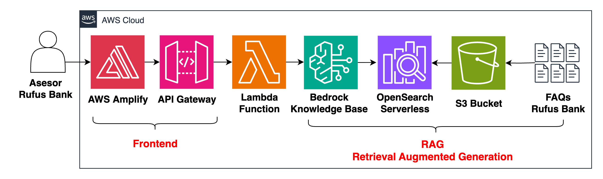
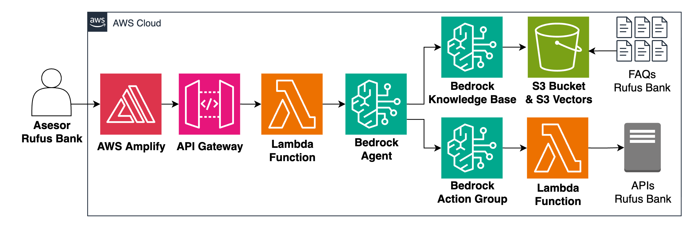
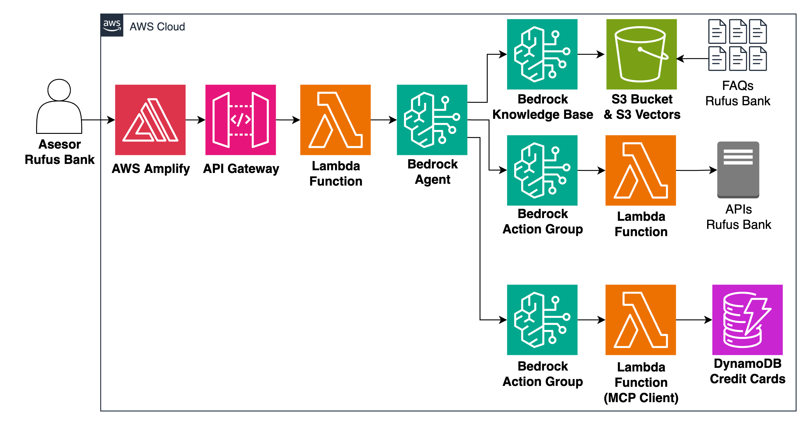
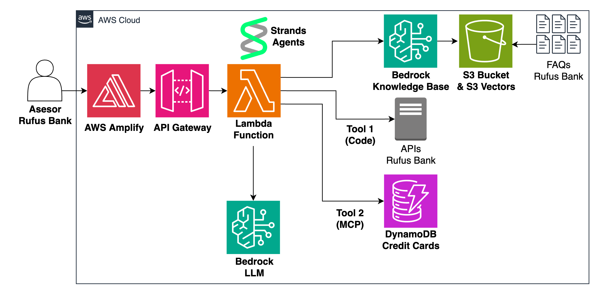
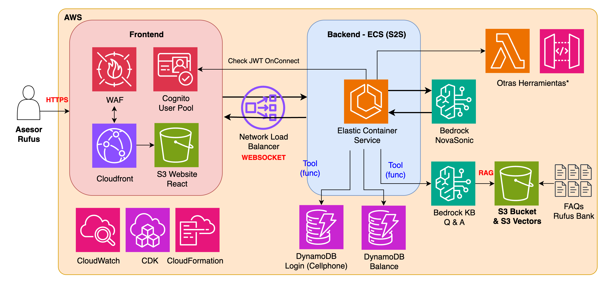
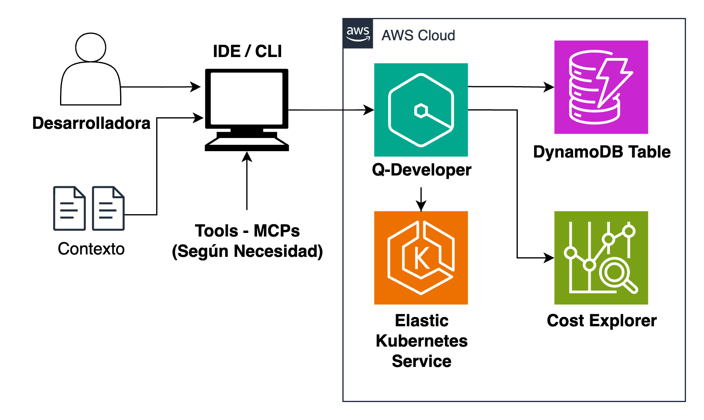
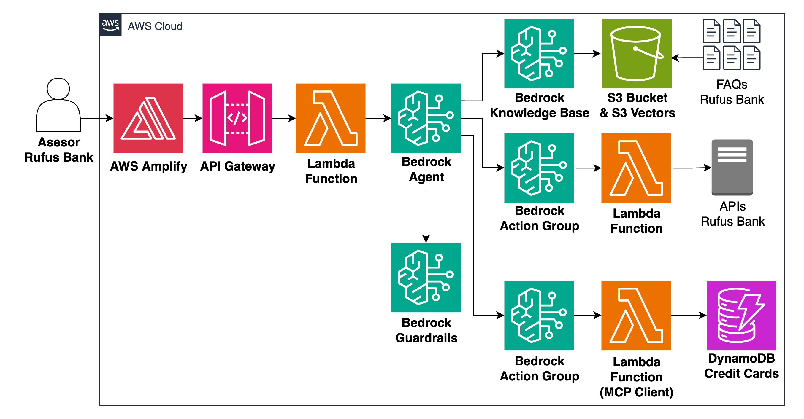

# 🌟 Retos Inteligencia Artificial Generativa 🚀

_Una aventura épica en el universo de la IA Generativa con temática Star Wars_

¡Bienvenidos, jóvenes Padawans, a una galaxia muy, muy lejana donde la Inteligencia Artificial Generativa es la Fuerza que guía nuestro destino! 🌌✨

Este repositorio contiene todos los materiales, proyectos y desafíos de nuestro programa de entrenamiento Jedi en IA Generativa. Desde los fundamentos de tokens y embeddings hasta la creación de agentes inteligentes y sistemas conversacionales avanzados, cada clase te llevará un paso más cerca de convertirte en un Maestro Jedi de la IA. 🎯

---

## 🎯 Generalidades

Este programa de entrenamiento está diseñado para llevarte desde Padawan hasta Maestro Jedi en el arte de la Inteligencia Artificial Generativa. A través de 7 clases intensivas, exploraremos:

- 🧠 **Fundamentos de IA**: Tokens, embeddings y RAG (Retrieval Augmented Generation)
- 🤖 **Agentes Inteligentes**: Sistemas autónomos y multiagente
- 🔗 **Model Context Protocol (MCP)**: Protocolos avanzados de comunicación
- 🕸️ **Strands**: Procesos y aplicaciones en producción
- 🗣️ **Speech-to-Speech**: IA conversacional de nueva generación
- 💻 **Amazon Q Developer CLI**: Herramientas de productividad para desarrolladores
- 🛡️ **IA Responsable**: Guardrails y observabilidad

Cada sesión combina teoría sólida con práctica hands-on, utilizando las tecnologías más avanzadas de AWS y el ecosistema de IA generativa. ¡Que la Fuerza te acompañe en este viaje! 🌟

Accede al programa en:

- [AWS Women Colombia Events](https://www.meetup.com/aws-women-colombia-user-group/events/)

---

## 🎓 Clases

### 🌟 Clase 1: Iniciación Jedi - Dominando Tokens, Embeddings y RAG

**Speaker**: Santiago García Arango 👨‍🏫 [@san99tiago](https://www.github.com/san99tiago)

**Fecha**: 28 de agosto

**Link**: [Video Iniciación Jedi: Dominando Tokens, Embeddings y RAG](https://youtu.be/vCJzM6xzMRU)

¡Tu viaje Jedi comienza aquí! En esta primera clase, aprenderás los fundamentos esenciales de la IA Generativa. Descubrirás qué son los tokens, cómo funcionan los embeddings y dominarás el arte del RAG (Retrieval Augmented Generation).

**🎯 Objetivos de aprendizaje:**

- Comprende los fundamentos de los LLMs y su funcionamiento interno
- Domina los conceptos de tokens y embeddings
- Implementa tu primer sistema RAG funcional

**🛠️ Proyecto práctico:**

- Creación de documentos tipo FAQs
- Configuración de S3 Bucket para almacenamiento
- Implementación de Knowledge Base con vectores
- Sincronización y consultas al sistema RAG

  

---

### 🤖 Clase 2: Maestros del Conocimiento - Agentes y Multiagentes

**Speaker**: Luisa Vesga 👩‍🏫

**Fecha**: 4 de septiembre

**Link**: Pronto-agregaremos-links

¡Es hora de crear tus primeros agentes inteligentes! Aprenderás a construir sistemas autónomos capaces de razonar, tomar decisiones y ejecutar acciones complejas.

**🎯 Objetivos de aprendizaje:**

- Domina los conceptos de Agentic AI
- Comprende la arquitectura de agentes (SystemPrompt, Tools, RAG, Chain-of-Thought)
- Explora Bedrock Agents y paradigmas multiagente

**🛠️ Proyecto práctico:**

- Creación de un agente de GenAI desde cero
- Integración con el RAG creado en la clase anterior
- Implementación de herramientas personalizadas con Lambda

  

---

### 📡 Clase 3: El Manual Jedi - MCP (Model Context Protocol)

**Speaker**: David Suárez 👨‍🏫

**Fecha**: 18 de septiembre

**Link**: Pronto-agregaremos-links

Descubre el poder del Model Context Protocol y cómo revoluciona la comunicación entre agentes y herramientas. ¡Conviértete en un maestro de la conectividad inteligente!

**🎯 Objetivos de aprendizaje:**

- Comprende los desafíos de crear Tools y contexto para agentes
- Domina la teoría del Model Context Protocol
- Explora MCP Servers y MCP Clients

**🛠️ Proyecto práctico:**

- Exploración de MCPs disponibles
- Implementación de MCPs de AWS Labs
- Demostración con Amazon Q Developer
- (Opcional) Creación de MCP personalizado y despliegue en Lambda

  

---

### 🕸️ Clase 4: La Red Secreta del Consejo Jedi - Strands

**Speaker**: Hazel Sáenz 👩‍🏫

**Fecha**: 25 de septiembre

**Link**: Pronto-agregaremos-links

Aprende a llevar tus agentes de desarrollo a producción con Strands. Descubre cómo simplificar la complejidad y escalar tus soluciones de IA.

**🎯 Objetivos de aprendizaje:**

- Comprende los retos de llevar agentes a producción
- Domina el framework Strands y su valor agregado
- Explora funcionalidades CORE: AnyModel, Tools, MCP, Observabilidad

**🛠️ Proyecto práctico:**

- Ejecución de ejemplos con Strands locales
- Creación de agentes con herramientas personalizadas
- Migración del agente de la Clase 2 a Strands
- (Opcional) Despliegue de agente en Lambda

  

---

### 🗣️ Clase 5: El Lenguaje de la Fuerza - Speech-to-Speech

**Speaker**: Luis Caro 👨‍🏫

**Fecha**: 2 de octubre

**Link**: Pronto-agregaremos-links

¡Entra en la era de la IA conversacional! Aprende a crear sistemas de comunicación natural que entienden y responden con voz humana.

**🎯 Objetivos de aprendizaje:**

- Comprende los desafíos de latencia en sistemas de voz
- Domina la tecnología Speech-to-Speech
- Explora Nova Sonic y sus capacidades avanzadas

**🛠️ Proyecto práctico:**

- Demostración visual impactante de S2S
- Creación de servidor Speech-to-Speech local
- Implementación de agente conversacional con voz
- (Opcional) Guía de despliegue en AWS

  

---

### 💻 Clase 6: Amazon Q Developer CLI - La Fuerza del Desarrollador

**Speaker**: Manuel Ortiz 👨‍💻

**Fecha**: 23 de octubre

**Link**: Pronto-agregaremos-links

Revoluciona tu productividad como desarrollador con Amazon Q Developer CLI. Descubre cómo la IA puede ser tu compañero perfecto de programación.

**🎯 Objetivos de aprendizaje:**

- Comprende la evolución de Agentic AI en el desarrollo
- Domina Amazon Q Developer y sus paradigmas
- Explora herramientas, agentes, reglas y MCPs

**🛠️ Proyecto práctico:**

- Instalación y configuración de Q Developer
- Uso de MCPs de costos y diagramas
- Creación de frontend para tu agente
- Integración con agentes de Bedrock existentes

  

---

### 🛡️ Clase 7: Guardianes de la Fuerza de la IA - IA Responsable y Observabilidad

**Speaker**: Mónica Ruiz 👩‍🏫

**Fecha**: 30 de octubre

**Link**: Pronto-agregaremos-links

Conviértete en un guardián responsable de la IA. Aprende a implementar medidas de seguridad, observabilidad y evaluación para sistemas de IA en producción.

**🎯 Objetivos de aprendizaje:**

- Comprende la importancia de la IA Responsable
- Domina OWASP Top 10 para LLMs
- Implementa Bedrock Guardrails y evaluaciones

**🛠️ Proyecto práctico:**

- Configuración de Guardrails con políticas personalizadas
- Integración de seguridad en proyectos existentes
- Exploración de Bedrock Model Evaluations

  

---

## 🎉 ¡Que la Fuerza te Acompañe!

Este programa te convertirá en un verdadero Maestro Jedi de la IA Generativa. Cada clase está diseñada para construir sobre la anterior, creando un conocimiento sólido y práctico que podrás aplicar inmediatamente en proyectos reales.

¡Prepárate para una aventura épica en el universo de la Inteligencia Artificial! 🚀✨

## 🔗 Links Recursos

### 📚 Documentación Oficial

- [AWS Bedrock Documentation](https://docs.aws.amazon.com/bedrock/)
- [Amazon Q Developer](https://aws.amazon.com/q/developer/)
- [Model Context Protocol](https://modelcontextprotocol.io/)
- [AWS Bedrock Agents](https://docs.aws.amazon.com/bedrock/latest/userguide/agents.html)

### 🛠️ Herramientas y SDKs

- [AWS CLI](https://aws.amazon.com/cli/)
- [Boto3 Python SDK](https://boto3.amazonaws.com/v1/documentation/api/latest/index.html)
- [Strands Framework](https://github.com/awslabs/strands)
- [MCP Servers](https://awslabs.github.io/mcp/)

### 🎓 Recursos de Aprendizaje

- [AWS AI/ML Learning Path](https://aws.amazon.com/training/learning-paths/machine-learning/)
- [Generative AI on AWS](https://aws.amazon.com/generative-ai/)
- [OWASP Top 10 for LLMs](https://owasp.org/www-project-top-10-for-large-language-model-applications/)

---

---

## 📄 Licencia

Copyright 2025 AWS Women Colombia y AWS User Group Medellín
